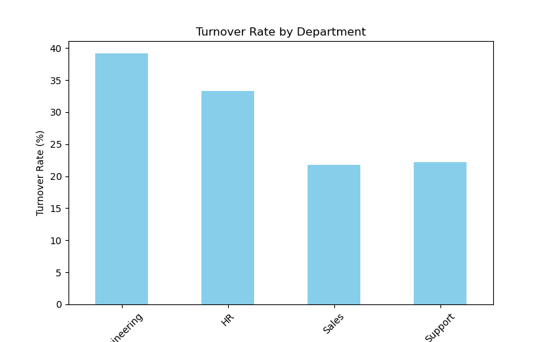
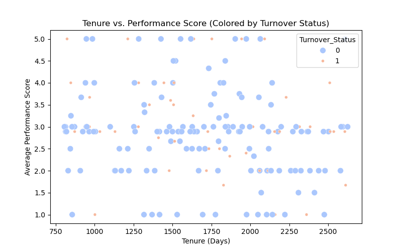
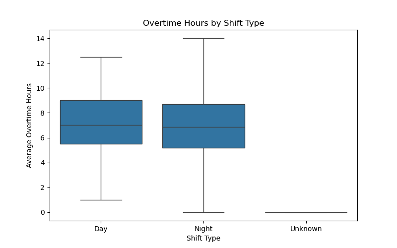

# Workforce-data-analysis-project
3. Open and run `workforce_analysis.ipynb` in Jupyter Notebook to reproduce the analysis and generate outputs.

### Prerequisites
- Python 3.x
- Jupyter Notebook
- Internet connection (for installing libraries if not pre-installed)

## Analysis Process
1. **Data Sources**: Simulated datasets for employees, performance reviews, and time tracking.
2. **Cleaning and Merging**: Combined data using `Employee_ID` as the key, handled missing values with means or zeros using Pandas.
3. **Key Performance Indicators (KPIs)**:
- Overall Turnover Rate: 29.00%
- Average Performance Score by Department:
  - Engineering: 3.02
  - HR: 2.98
  - Sales: 2.83
  - Support: 2.75
- Average Overtime Hours by Shift Type:
  - Day: 7.10 hours
  - Night: 6.82 hours
  - Unknown: 0.00 hours
4. **Visualizations**: Generated using Matplotlib and Seaborn to explore turnover, performance, and overtime trends.

## Key Findings
- **Turnover**: Engineering shows the highest turnover rate (around 35-40%), indicating a potential need for retention strategies.
- **Performance**: Support has the lowest average performance score (2.75), suggesting possible training or support gaps.
- **Overtime**: Day and Night shifts have similar overtime (6-7 hours), while Unknown shifts (likely missing data) report no overtime.

## Recommendations
- Investigate high turnover in Engineering and implement retention initiatives (e.g., better benefits or career development).
- Provide additional training or resources for the Support department to improve performance.
- Monitor overtime trends, especially for night shifts, to prevent employee burnout.

## Visualizations

## Skills Demonstrated
- Data merging and cleaning with Pandas.
- Data visualization with Matplotlib and Seaborn.
- Report generation and stakeholder communication.
- Project organization and documentation.

## Future Improvements
- Incorporate real-world data for more accurate insights.
- Add interactive filtering using Jupyter widgets.
- Expand analysis with additional metrics (e.g., salary impact on turnover or role-based performance).

## Acknowledgments
- Utilized open-source libraries (Pandas, Matplotlib, Seaborn) for analysis and visualization.
